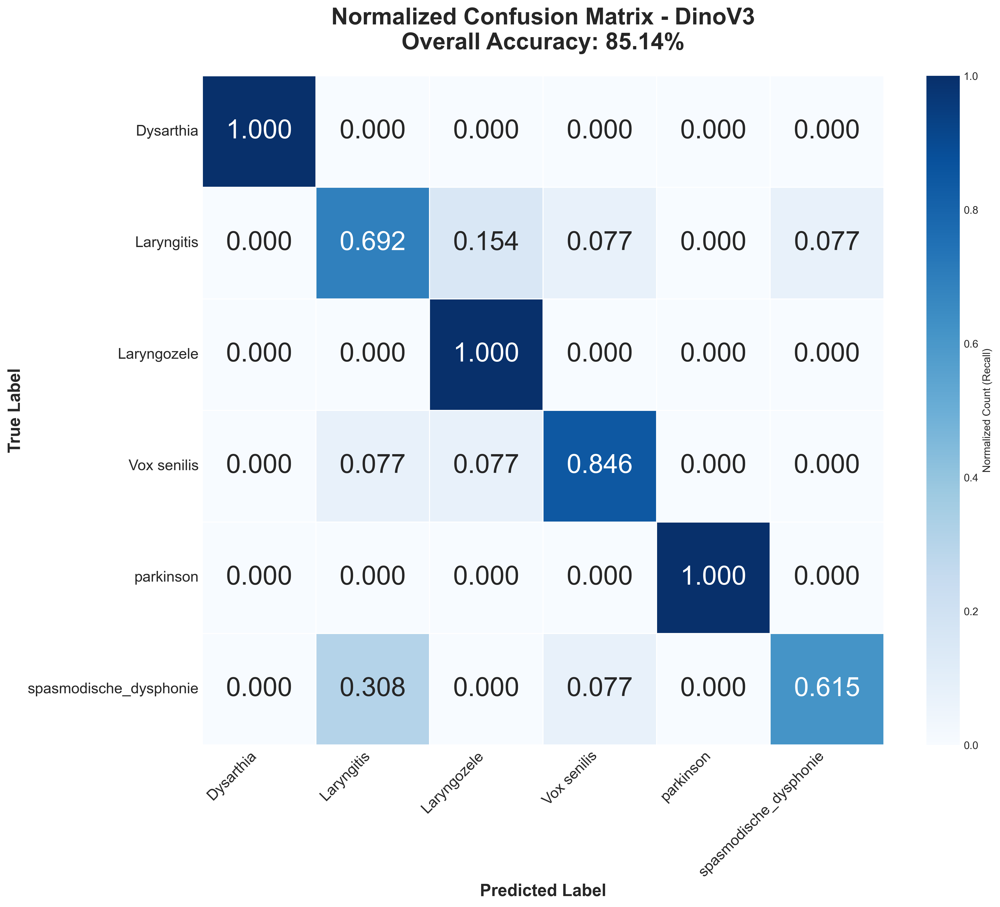
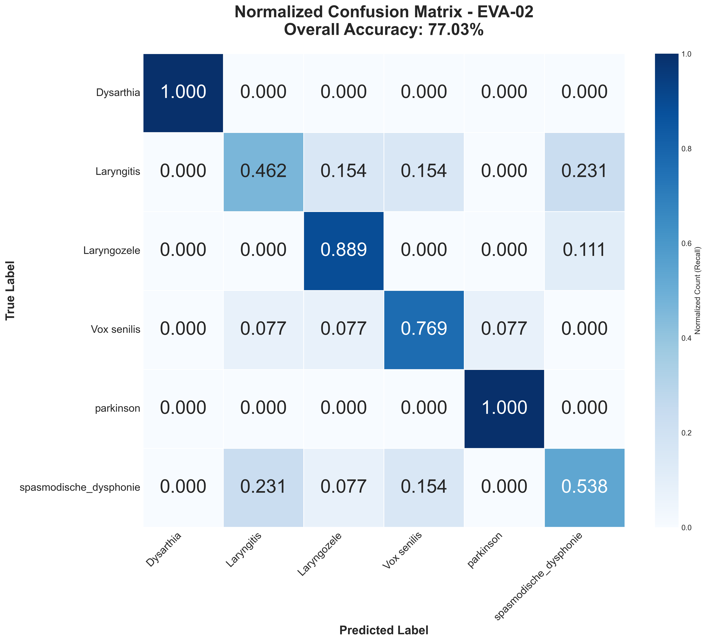
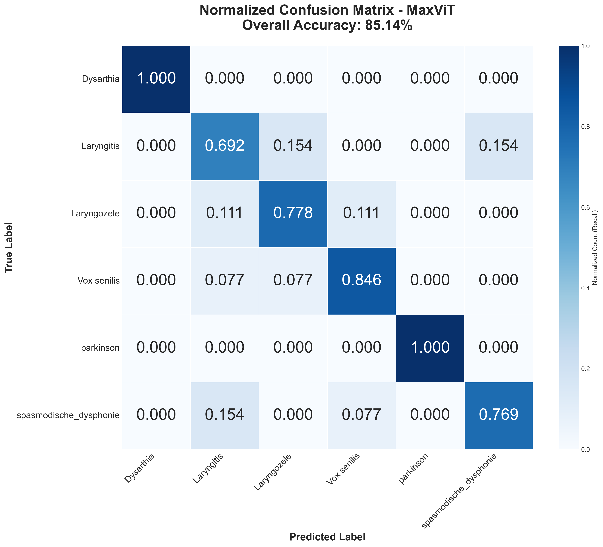
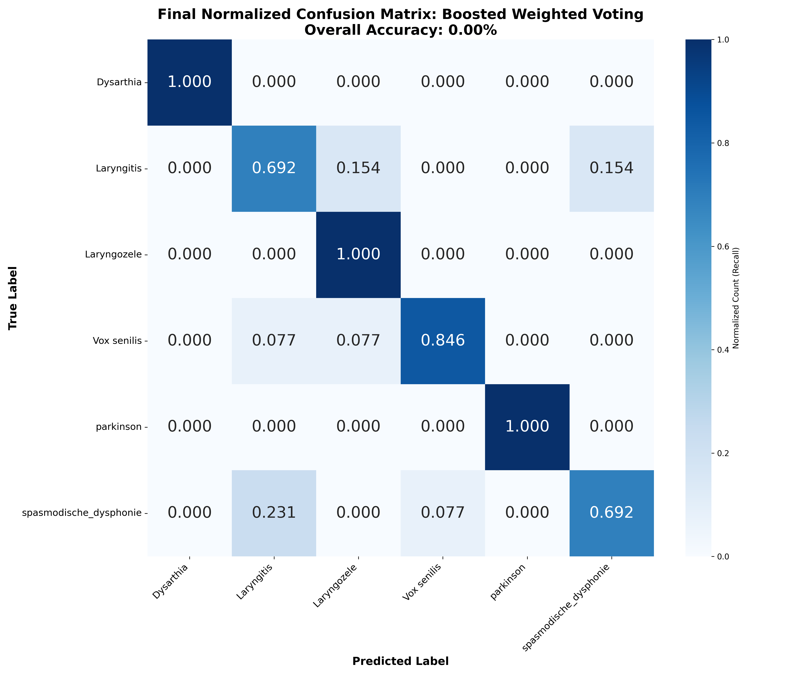
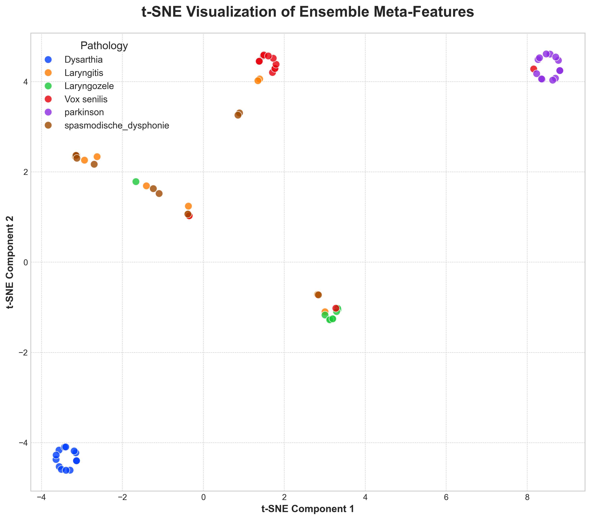

# Spectrogram-VisionTransformer

A research-focused benchmark repository for **voice-disorder classification from spectrograms** using CNN/ViT-family backbones and ensemble strategies.

## 1) Research Objective

This project studies how modern vision architectures perform when trained on spectrogram images derived from pathological voice recordings, with focus on:

- single-model performance across transformer families,
- confusion patterns between clinically similar classes,
- gains from weighted/boosted voting ensembles,
- representation quality in learned feature space.

## 2) Dataset and Label Space

Notebook outputs indicate:

- **864 `.wav` files** processed during audio normalization (`dataset.ipynb`),
- evaluation on a **74-sample test split** (`test.ipynb`),
- main classification labels used in evaluation reports:
  - Dysarthia
  - Laryngitis
  - Laryngozele
  - Vox senilis
  - parkinson
  - spasmodische_dysphonie

## 3) Preprocessing Pipeline

Implemented in the data notebooks:

1. Peak normalization (`Datasets/` -> `DatasetNormalized/`)
2. Silence trimming (`DatasetNormalized/` -> `DatasetTrimmed/`)
3. Spectrogram generation and split handling (see `data.ipynb`, `dataset.ipynb`)

## 4) Model Families Explored

- `v1 focal/focal_90.ipynb` (focal-loss-based ViT training)
- `v2 GFT/GFT.ipynb`
- `v3 dinov3/dinov3.ipynb`
- `V5 Eva02/Eva02.ipynb`
- `v6 maxVit/maxvit.ipynb`
- `v7 Cait/cait.ipynb`
- `CNN/cnn.ipynb`
- `voting.ipynb` (ensemble/stacking/weighted voting)
- `ablation.ipynb` (ablation and comparative analysis)

## 5) Reported Metrics (from notebook outputs)

### 5.1 Single-model test accuracies

| Model / Notebook | Reported Test Accuracy |
|---|---:|
| DinoV3 (`test.ipynb`) | **85.14%** |
| MaxViT (`test.ipynb`) | **85.14%** |
| EVA-02 (`test.ipynb`, `V5 Eva02/Eva02.ipynb`) | **77.03%** |
| CaiT (`v7 Cait/cait.ipynb`) | **81.08%** (also 83.78% in later fine-tuned evaluation cell) |
| Focal ViT (`v1 focal/focal_90.ipynb`) | **79.73%** (81.08% fine-tuned test report) |
| GFT (`v2 GFT/GFT.ipynb`) | **62.16%** |
| Diet (`v4 diet/diet.ipynb`) | **66.22%** (71.62% final fine-tuned test report) |

### 5.2 Ensemble and ablation outcomes

| Configuration | Reported Accuracy |
|---|---:|
| Weighted/boosted voting (`voting.ipynb`) | **86.49%** |
| Alternative ensemble setting (`voting.ipynb`) | **83.78%** |
| Ablation best (`ablation.ipynb`) | **86.49%** |
| Ablation comparison point (`ablation.ipynb`) | **85.14%** |

### 5.3 Class-sensitive behavior

From `test.ipynb`:

- Laryngitis accuracy:
  - DinoV3: **69.23%**
  - MaxViT: **69.23%**
  - EVA-02: **46.15%**

This indicates that class-level robustness, not just overall accuracy, is a key differentiator.

## 6) Visual Evidence and Analysis Artifacts

### 6.1 Normalized confusion matrices

### DinoV3

### EVA-02

### MaxViT

### 6.2 Final ensemble confusion matrix

### 6.3 Feature-space visualizations (t-SNE)

Additional figure assets are available under:

- `/images/`
- `/V5 Eva02/`
- model folders (`v1 focal/`, `v3 dinov3/`, `v4 diet/`, `v6 maxVit/`)

## 7) Key Findings

1. **Strongest single models** in current logged runs are DinoV3 and MaxViT at ~85.14%.
2. **Ensembling improves peak performance** to **86.49%**, outperforming single-backbone runs.
3. **Class-specific difficulty remains**, especially for Laryngitis in some backbones.
4. The repository includes both **quantitative** (accuracy/confusion) and **qualitative** (t-SNE/feature-space) evidence suitable for research reporting.

## 8) Reproducibility Notes

Primary experimentation is notebook-driven. To reproduce reported outputs, execute notebooks in this approximate order:

1. `dataset.ipynb` / `data.ipynb` (data preparation)
2. model notebooks (`v1`, `v2`, `v3`, `V5`, `v6`, `v7`, `CNN`)
3. `test.ipynb` (cross-model evaluation)
4. `voting.ipynb` and `ablation.ipynb` (ensemble + ablation)
5. `scatter.ipynb` / `visual.ipynb` (representation analysis)

## 9) Repository Figure Index (quick access)

- `final_normalized_confusion_matrix.png`
- `normalized_confusion_matrix_DinoV3_hd.png`
- `normalized_confusion_matrix_EVA-02_hd.png`
- `normalized_confusion_matrix_MaxViT_hd.png`
- `tsne_meta_features.png`
- `images/final_confusion_matrix.png`
- `images/final_confusion_matrix_corrected.png`
- `images/tsne_feature_space.png`
- `images/tsne_feature_space_eva02.png`
- `images/tsne_feature_space_maxvit.png`

---

If you want, this README can be extended further with a strict paper format (Abstract, Methods, Results, Threats to Validity, and References) and per-class metric tables exported directly from notebook classification reports.
